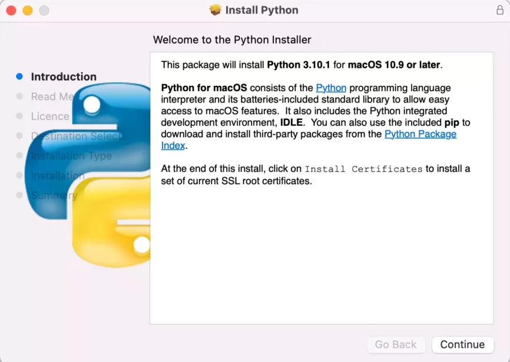

#  Lesson  1 - Introduction and Installation

1. Introduction to Python
2. Setup and Installation

# 1. Introduction to Python

**Python** is a popular high-level, general-purpose programming language and the preferred choice for many to start learning about programming. It was created by [Guido van Rossum](https://en.wikipedia.org/wiki/Guido_van_Rossum) 1989 at the Centrum Wiskunde & Informatica (CWI) in the Netherlands. The name Python was derived from _"Monty Python's Fliying Circus"_, what Guido von Rossum was reading when he began implementing this Python.


# 2. Setup and Installation
We need two things before we can start programming. First of all we need **Python** itself! You can download the latest version of Python from the [offical website](https://www.python.org/downloads/). Recent release came with major improvements in performance but Python is still in development and under constant scrutiny, so make sure to download the latest stable version of it. Currently that is 3.12 but this might be different, depending on when you are reading this.

In case you on Windows, the installtion might look like this for you. Make sure to add python.exe to PATH. This will simplify your life 😃.

<div style="text-align:center">
    
</div>
If you are on a mac there aren't checkboxes that you have to click, just go had and install it. This how it might look for you:

<div style="text-align:center">
    
</div>

For you the linux users, i guess i don't have to explain anything to you! You will figure it out 😉!

To make sure everything worked, open a terminal and type in:

```bash
python --version
```
This should return your current version (e.g. Python 3.12.0).

We are halfway through the installation. What's next? We need a place to write and execute our Python code. There are general two different types of **Code editors** and **IDEs** (Integrated Development Enviroment). We definitly want to use an IDE, because it delivers a more complete experience for us. 

There is a wide range of tools available, worth mentioning are [VScode](https://code.visualstudio.com/) and [PyCharm](https://www.jetbrains.com/pycharm/). My prefered choice and those of most developers according to the most recent [Stackoverflow developer survey](https://survey.stackoverflow.co/2023/#integrated-development-environment) is **VScode**. I personal like the rich ecosystem of extensions, but we will get to that later. So I highly recommand you to install VScode but it's not mandatory.

Download the latest version of VScode for your OS (Operating System) [here](https://code.visualstudio.com/).

## Add full explaination for VSCode

Let's go through the basics of **VScode** before we move on the the next lesson. Open VScode 

# Further Reading

1. [Wikipedia Artilce](https://de.wikipedia.org/wiki/Python_(Programmiersprache)) 
2. [Official Python Documentation](https://de.wikipedia.org/wiki/Python_(Programmiersprache)) 