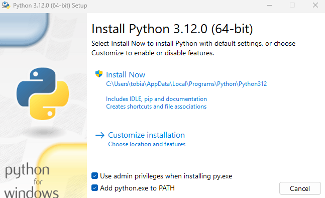
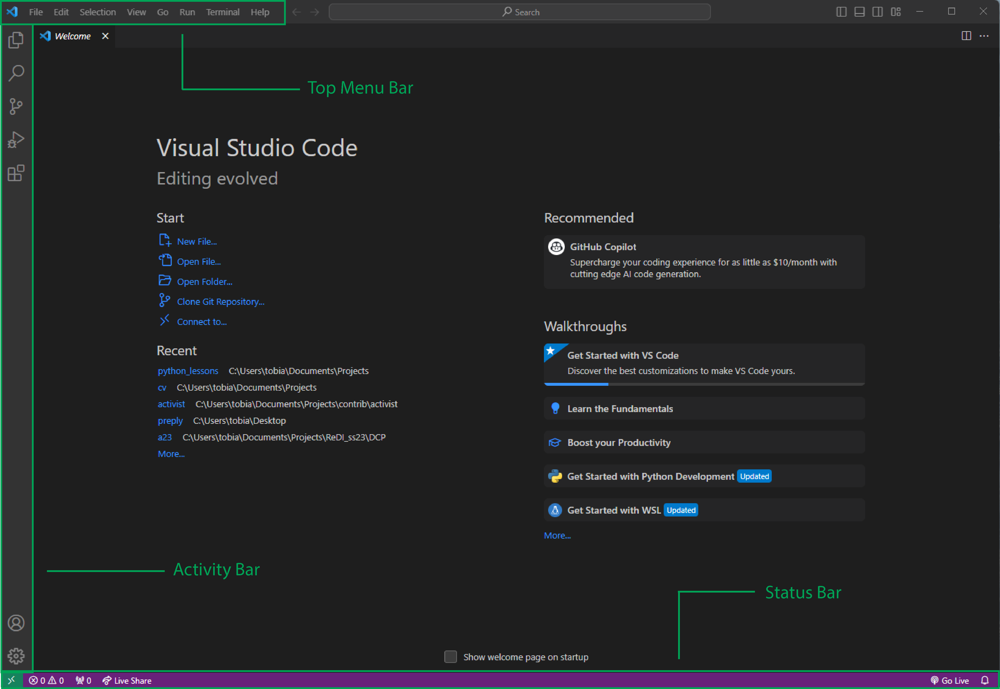
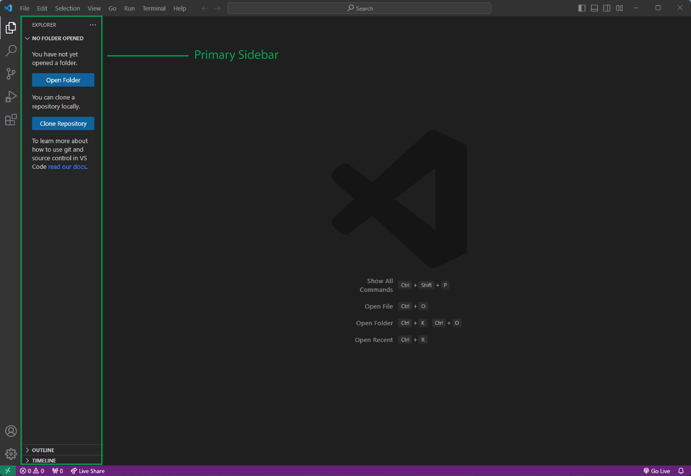
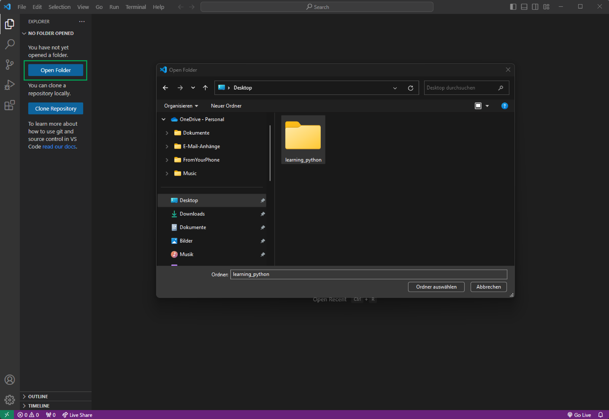
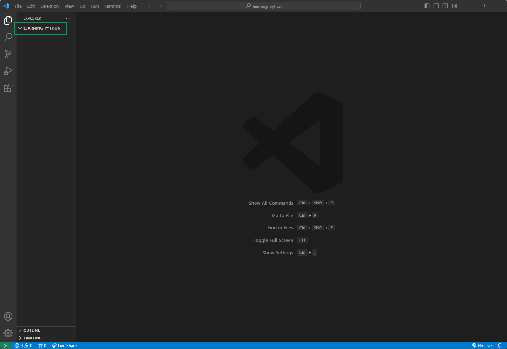
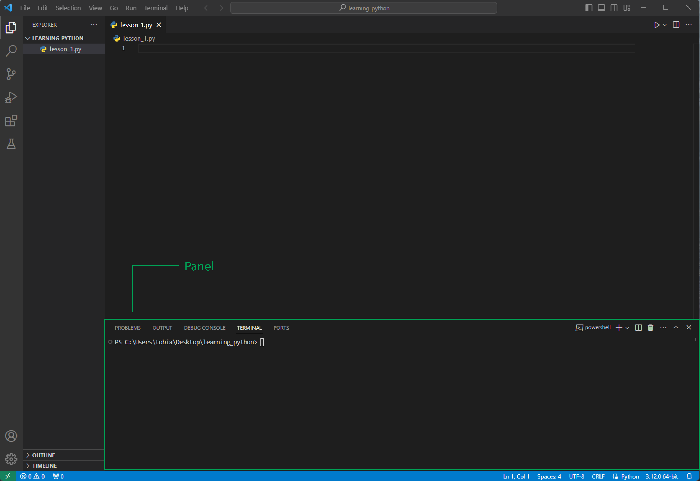
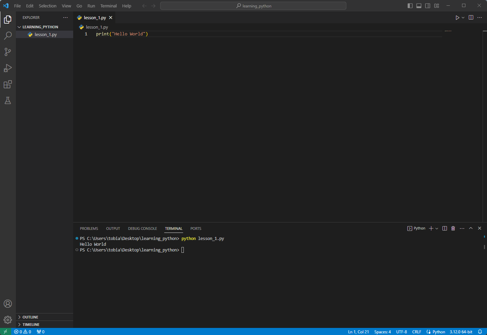

#  Lesson  1 - Introduction and Installation

1. Introduction to Python
2. Setup and Installation
3. Exercise

# 1. Introduction to Python

**Python** is a popular high-level, general-purpose programming language that is the preferred choice for many beginners in programming. It was created by [Guido van Rossum](https://en.wikipedia.org/wiki/Guido_van_Rossum) in 1989 at the Centrum Wiskunde & Informatica (CWI) in the Netherlands. The name **Python** was derived from [_"Monty Python's Flying Circus"_](https://wikipedia.org/wiki/Monty_Python%27s_Flying_Circus), which Guido van Rossum was reading when he began implementing Python.

Python is known for its simplicity and readability, which make it an excellent choice for beginners. It supports multiple programming paradigms, including procedural, object-oriented, and functional programming. It has a large standard library that is available for use without the need for additional installation. This library includes areas like web service tools, string operations, internet protocols, and operating system interfaces. Many high-profile tech companies use Python, including Google, NASA, and Facebook.

# 2. Setup and Installation
Before we can start programming, we need two things. First and foremost, we need **Python** itself! You can download the latest version of Python from the [official website](https://www.python.org/downloads/). The recent release has brought major improvements in performance. However, as Python is still under development and constant scrutiny, it's crucial to download the latest stable version. At the time of writing, the current stable version is 3.12, but this may vary depending on when you are reading this.


On Windows, the installation process may appear slightly different. It’s important to add python.exe to your PATH during this process. Doing so will greatly simplify your programming experience! :smiley:

<p align="center">
    

</p>

On a Mac, the installation process is straightforward; there aren’t any checkboxes to select, just proceed with the installation. As for Linux users, I’m confident you’ll navigate the process with ease! You’ve got this! :wink:

To verify that the installation was successful, open a terminal and enter the following command:

```bash
python --version
```
This should return your current version (e.g. Python 3.12.0).

Sure, here's your revised text:

We're halfway through the installation process. So, what's next? We need a suitable environment to write and execute our Python code. Generally, there are two types of environments: **Code editors** and **IDEs** (Integrated Development Environments). We definitely want to opt for an IDE, as it provides a more comprehensive experience for us.

A variety of tools are available for Python development, with [VScode](https://code.visualstudio.com/) and [PyCharm](https://www.jetbrains.com/pycharm/) being noteworthy mentions. According to the most recent [Stackoverflow developer survey](https://survey.stackoverflow.co/2023/#integrated-development-environment), **VScode** is the preferred choice for most developers, and it's my personal favorite as well. I particularly appreciate its rich ecosystem of extensions, which we'll delve into later. I strongly recommend installing VScode, although it's not a requirement.

Download the latest version of VScode for your OS (Operating System) [here](https://code.visualstudio.com/).

## Add full explaination for VSCode and Python shell

Before we proceed to the next lesson, let’s familiarize ourselves with the basics of VScode. When you launch VScode, you’ll be welcomed with a this screen:

<p align="center">
    
</p>

Next, create a folder for our lessons named **"learning_python"**. You can place this on your desktop or any location of your choice :smiley:. Once done, return to VScode and open the newly created folder. Click on the Folder icon located in the **activity bar** on the left; this action will open the **primary sidebar**.

<p align="center">
    
</p>

Next, click on the **Open Folder** button and navigate to the "learning_python" folder that we just created.

<p align="center">
    
</p>

The name of the folder we just opened, “learning_python”, should now appear at the top of the **primary sidebar**.

<p align="center">
    
</p>

Sure, here's your revised text:

The next step involves creating our first Python file within this folder. There are several ways to accomplish this:

* Icons for creating files and folders are located next to your folder name in the view toolbar. (You might need to click or hover over the primary sidebar for these icons to appear.)
* At the top of the window, within the menu bar, click on 'File' and select 'New File' from the dropdown menu.
* Right-click within the primary sidebar and select 'New File' from the dropdown menu.

Let's name our first file **lesson_1.py** (Python files end with the `.py` file extension). Upon creating the file, the editor will open. In the status bar at the bottom right, you should see 'Python' (VScode determines the language of your file based on its extension) along with your installed version (in this case, 3.12.0).

<p align="center">
    
</p>

Navigate to the top menu bar and click on "Terminal". From the dropdown menu that appears, select "New Terminal". This action will open the Terminal within the **Panel** at the bottom of the screen. The Terminal will be in the same directory as our folder.

<p align="center">
    
</p>

Sure, here's your revised text:

In our final step, we will write our first line of Python code, the classic `Hello World`:

```python
print("Hello World!")
```

After adding the print statement, we can run our newly created Python file in the terminal using the following command:

```bash
python lesson_1.py
```

<p align="center">
    
</p>

Python also includes an interactive shell. By typing **"python"** in the terminal, you can start executing Python code directly. To exit the shell, simply use `exit()`.

To complete our setup, let's install a few useful extensions for VScode:

1. [Python](https://marketplace.visualstudio.com/items?itemName=ms-python.python) (This essential Python extension includes Jupyter notebook support and Pylance.)
2. [Black](https://marketplace.visualstudio.com/items?itemName=ms-python.black-formatter) (A popular Python code formatter.)
3. [Ruff](https://marketplace.visualstudio.com/items?itemName=charliermarsh.ruff) (A very fast and popular Python linter that will help keep your code clean.)
4. [Material Icon Theme](https://marketplace.visualstudio.com/items?itemName=PKief.material-icon-theme) (While not necessary, this extension will display appropriate icons for files and folders.)

There are many more useful extensions available for installation, but these should be particularly helpful for following the lessons.

## 3. Exercise
The objective of our first lesson is to familiarize ourselves with VScode and Python. There is no additional exercise for this lesson. If you haven’t done so already, here’s a recap of the steps we’ve covered above.

1. Create a folder "python_lessons"
2. Open the folder in VScode
3. Create a file within the folder "lesson_1.py"
4. Write the following print statement

    ```python
    print("Hello World!")
    ```
5. Run the Python script.

That's all for our first lesson :smiley:

# Further Reading

1. [Wikipedia Artilce](https://de.wikipedia.org/wiki/Python_(Programmiersprache)) 
2. [Official Python Documentation](https://de.wikipedia.org/wiki/Python_(Programmiersprache)) 
3. [VScode User interface](https://code.visualstudio.com/api/ux-guidelines/overview)